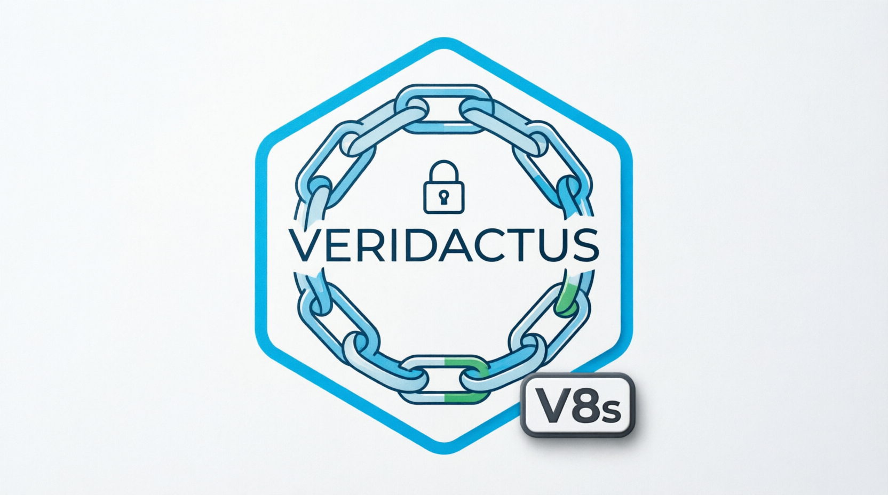
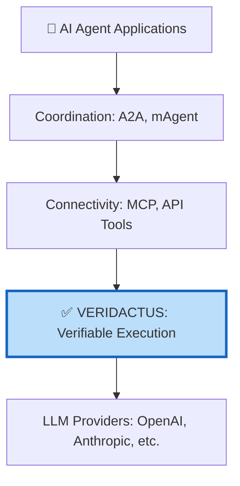
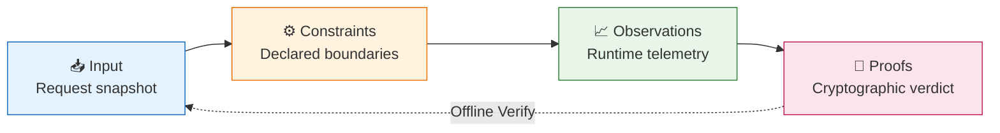
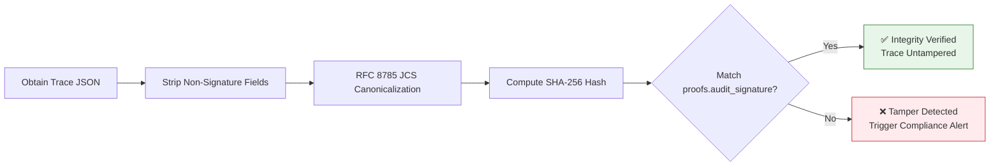
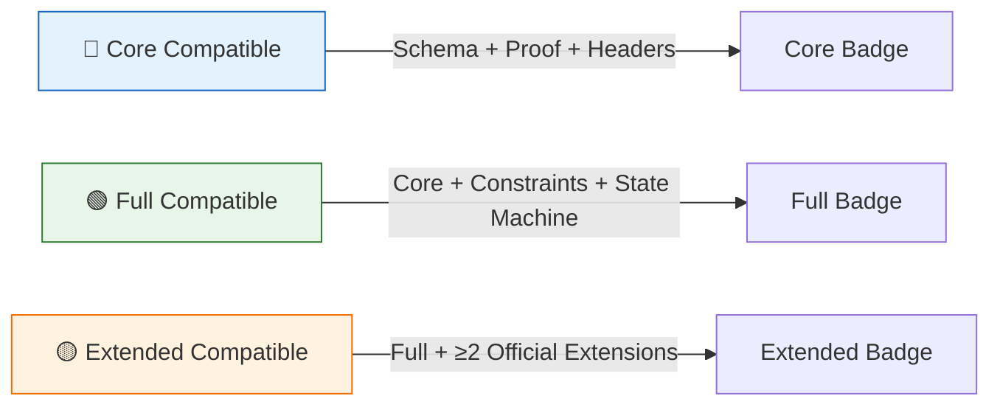
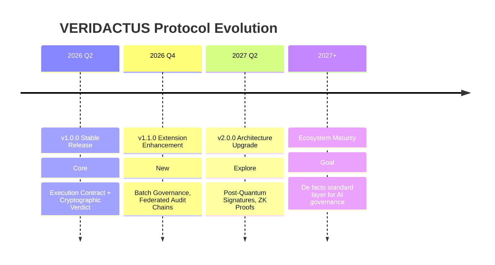

# 📘 VERIDACTUS Protocol Specification v1.0.0

<p align="center">
  <br/>
  
  
</p>

<p align="center">
  <a href="spec/1.0_abstract_and_scope.md"></a>
  <a href="conformance/v1/certification_criteria.md"></a>
  <a href="spec/2.0_terminology_and_notation.md"></a>
  <a href="GOVERNANCE.md"></a>
</p>

<p align="center">
  <strong>The Verifiable Execution Layer for AI Agents</strong><br/>
  <em>VERIDACTUS transforms every LLM invocation into a <strong>deterministic, cryptographically verifiable engineering event</strong>.</em><br/>
  No server. No secret. No trust required.<br/>
  <strong><em>A verdict you can verify — not a black box you must blindly trust.</em></strong>
</p>

<p align="center">
  <a href="#-quick-start">⚡ Quick Start</a> •
  <a href="#-documentation">📚 Documentation</a> •
  <a href="#-community">🌐 Community</a> •
  <a href="#-conformance">✅ Conformance</a>
</p>

---

## 🌐 Language / 语言

[**🇬 English**](README.md) · [**🇨🇳 中文**](README-zh.md)

---

## 🧭 Why `VERIDACTUS`? — The Name As a Design Contract

Great protocols are named after the thing they guarantee. `VERIDACTUS` is no exception.

### Etymology & Semantic Precision

| Root | Origin | Meaning | Protocol Mapping |
|:---|:---|:---|:---|
| **`Verus`** | Latin | *true, real, verified* | Cryptographic integrity: every trace can be independently proven authentic via RFC 8785 + SHA-256 |
| **`Actus`** | Latin | *action, execution, legal deed* | Enforcement backbone: streaming budget cutoffs, privacy masking, deterministic replay turn inference into verifiable engineering actions |

**Together**: *a verified deed of execution*. The protocol doesn't just observe what an AI did — it legally, cryptographically, and operationally proves **the contract under which it acted**.

### Engineering Shorthand: `V8s`

Following the kernel tradition (K8s, K9s, etc.), the protocol's CLI, namespace, and developer tools use `V8s` — 8 letters between **V** and **s**.

| Context | Usage | Example |
|:---|:---|:---|
| Formal specification, academic papers | `VERIDACTUS Protocol` | "VERIDACTUS defines the Execution Contract model" |
| Command-line tool | `v8s` | `v8s proxy --listen :8080`, `v8s verify trace.json` |
| Code namespaces | `io.v8s.*`, `com.v8s.*` | `io.v8s.contract.Trace`, `com.v8s.audit.Verifier` |
| HTTP headers | `Veridactus-*` (full name) | `Veridactus-Version: 1.0.0`, `Veridactus-Budget-Limit: 0.05` |
| Community shorthand | `V8s` | "Join the V8s ecosystem" |

> 💡 **Naming is the first line of code**. `VERIDACTUS` establishes the mental model: *"Every AI action must be cryptographically provable."*

---

## 🌐 Strategic Positioning in the AI Stack

The AI agent revolution has solved two critical layers — **connectivity** and **coordination** — but left a third, foundational gap: **verifiability**.



VERIDACTUS is **orthogonal, not competitive**. It acts as a transparent governance proxy — no client code changes, no extra network hops. Every request passing through it gains:

- ✅ **Declarative constraint enforcement** (budget, privacy, reproducibility)
- ✅ **Streaming cost metering with atomic hard‑stop**
- ✅ **Cryptographic proof of execution** courtesy of JCS + SHA‑256

### Protocol Comparison Matrix

| Aspect | MCP (Anthropic) | A2A (Google) | IETF AAT | **VERIDACTUS** |
|:---|:---|:---|:---|:---|
| **Primary Purpose** | Tool connectivity | Agent coordination | Standardized audit log format | **Verifiable execution proof** |
| **Core Question** | *Can the agent reach the tool?* | *Can agents talk to each other?* | *What did the agent do?* | ***How, why, and under what rules was this output produced?*** |
| **Verification Model** | Out of scope | Out of scope | Trust in logging infrastructure | **Zero‑trust, offline mathematical verification** |
| **Runtime Enforcement** | None | None | None | **Real‑time budget cutoff, privacy masking, constraint engine** |
| **Cryptographic Integrity** | None | None | None | **JCS + SHA‑256 hash chain with independent validation** |

> 💡 MCP connects tools. A2A coordinates agents. AAT records events. **VERIDACTUS delivers the cryptographic verdict that those events are true.**

---

## 🧠 Core Abstraction: The Execution Contract

Every LLM call is modeled as a verifiable **four‑tuple lifecycle** — an *Execution Contract* — that turns probabilistic inference into an auditable engineering event.



| Tuple | Semantic Responsibility | Generated When | Protocol Guarantee |
|:---|:---|:---|:---|
| **📥 Input** | Complete snapshot of request context (prompt, model, params, metadata) | `INIT` phase | Immutable; the baseline for diff and replay |
| **⚙️ Constraints** | Declarative execution boundaries: budget limits, privacy levels, reproducibility seeds | `CONSTRAINT_EVAL` phase | Violations block upstream *before* tokens are consumed |
| **📈 Observations** | Runtime telemetry: token counts, cost (micro‑cents), latency, state transitions, errors | `EXECUTING` → `VALIDATION` | Enables real‑time budget cutoff and degrade strategies |
| **🔐 Proofs** | SHA‑256 digest of the canonicalized contract (RFC 8785) | `FINALIZED` or `FAILED` | Any party can recompute the proof offline — no key, no database |

This contract transforms AI from a *trust‑me* problem into a *verify‑me* one.

---

## 🔒 Zero‑Trust Verification: Proven True, Not Trusted

VERIDACTUS operates on a radical assumption: **the network, the proxy, even the storage are all hostile**.  
Independent verification requires only three public things:

1. The raw Trace JSON
2. The public [RFC 8785 JSON Canonicalization Scheme](https://www.rfc-editor.org/rfc/rfc8785)
3. Any SHA‑256 implementation

```bash
# Offline verification — no proxy, no SDK, no central authority
# Step 1: Strip non-contract fields, canonicalize per RFC 8785
jq 'del(._*, .observations.internal_metrics)' trace.json | \
  v8s jcs | sha256sum

# Step 2: Compare against trace.proofs.audit_signature
# ✅ Match → The verdict is intact. The execution contract is unbroken.
# ❌ Mismatch → Tampering detected. Investigation required.
```

> 🔐 *This is the cryptographic equivalent of a judicial evidence seal. If the seal is broken, the evidence is inadmissible.*  
> VERIDACTUS seals every single AI action the same way.

### Verification Flow



---

## 🛡️ End‑to‑End Capabilities

| Capability | What It Does | Enterprise Impact |
|:---|:---|:---|
| 🔐 **Cryptographic Verdict** | JCS + SHA‑256 hash over the full execution contract | Satisfies EU AI Act, HIPAA, SOC 2 — replaces trust with math |
| 💰 **Streaming Budget Control** | Atomic micro‑cent metering; hard‑stop when the contract ceiling is reached | Prevents runaway agent spend; powers AI FinOps |
| 🛡️ **Privacy Grading** | `raw` / `masked` / `hash_only` storage policies | Operationalizes GDPR data minimization and CCPA deletion rights |
| 🔄 **Deterministic Replay & Diff** | Baseline‑candidate comparison with semantic risk scoring | CI/CD gates for model upgrades; regression‑test entire agent behavior |
| 🧩 **Extensible Namespacing** | `veridactus.ai/v{major}/{feature}` isolation | Pluggable policy engines, memory firewalls, economic SLAs — without core protocol changes |

---

## 🌍 Standards & Compliance Alignment

VERIDACTUS is built for the regulatory reality of AI:

| Standard / Framework | VERIDACTUS Mapping |
|:---|:---|
| **NIST AI RMF 1.0** | `constraints` → GOVERN, `observations` → MAP, `risk` → MEASURE, `audit` → MANAGE |
| **ISO/IEC 42001** | Execution lifecycle + tamper‑evident proofs support AIMS from day one |
| **GDPR / CCPA** | Privacy grading, TTL expiry, and deletion audit logs make data‑subject rights operational |
| **EU AI Act (Art. 12)** | Cryptographically signed logs fulfil record‑keeping for high‑risk AI |
| **OpenTelemetry GenAI** | Native `gen_ai.*` attribute mapping; OTLP export of spans and metrics |
| **W3C PROV** | Lineage via `parent_id` ⇔ `prov:wasDerivedFrom` |
| **OWASP LLM Top 10 v2.0** | Threat model covers prompt injection, unbounded consumption, insecure output, embeddings leakage |

> 🏛️ Your compliance playbook already exists. VERIDACTUS just gives it **cryptographic teeth**.

---

## 🗂️ Repository Ecosystem

| Repository | Purpose | Language | Status |
|:---|:---|:---|:---|
| [**spec**](https://github.com/veridactus/spec) | Protocol specification, RFCs, JSON Schemas | Markdown / JSON Schema | ✅ Stable v1.0.0 |
| [**v8s**](https://github.com/veridactus/v8s) | Reference CLI — the `v8s` binary | Go | 🚧 Beta |
| [**sdk‑python**](https://github.com/veridactus/sdk-python) | Python SDK with OTel export | Python | 🚧 Beta |
| [**validator‑js**](https://github.com/veridactus/validator-js) | Schema validation & CI badge integration | JavaScript | ✅ Stable |
| [**conformance**](https://github.com/veridactus/spec/tree/main/conformance/v1) | Automated test suite & certification | Python / Shell | ✅ Active |

> 💡 `v8s` is the engineering interface. Use it as you would `kubectl` — it translates the full VERIDACTUS contract into a developer‑friendly CLI.

---

## 🚀 60‑Second Quick Start

```bash
# 1. Install the reference CLI
go install github.com/veridactus/v8s/cmd/v8s@latest

# 2. Start a governance proxy
export OPENAI_BASE_URL="https://api.openai.com"
v8s proxy --listen :8080 --upstream "$OPENAI_BASE_URL"

# 3. Send a governed request with VERIDACTUS headers
curl -X POST http://localhost:8080/v1/chat/completions \
  -H "Content-Type: application/json" \
  -H "Veridactus-Version: 1.0.0" \
  -H "Veridactus-Budget-Limit: 0.05" \
  -H "Veridactus-Privacy-Level: masked" \
  -d '{
    "model": "gpt-4o",
    "messages": [{"role": "user", "content": "Summarize the Q3 report."}]
  }'

# 4. Later — offline, in a courtroom, or in a CI pipeline — verify the verdict
v8s verify trace.json
# ✅ "Integrity verified: execution contract intact."
```

📖 [Full Specification](spec/) · 📐 [JSON Schemas](schemas/v1/) · 🧪 [Conformance Suite](conformance/v1/) · 📜 [Contributing Guide](CONTRIBUTING.md)

---

## 🏅 Conformance Certification

Certification is **fully automated, objective, and no‑gatekeeper**. Implementations earn badges by passing public test vectors.



| Tier | Requirements | Badge |
|:---|:---|:---|
| 🔵 **Core Compatible** | Schema validation + Proof integrity + Header negotiation | [](conformance/v1/certification_criteria.md) |
| 🟢 **Full Compatible** | Core + Budget enforcement + State machine + Error contract | [](conformance/v1/certification_criteria.md) |
| 🟡 **Extended Compatible** | Full + ≥2 official extensions (e.g., `memory_firewall`, `economic_sla`) | [](conformance/v1/certification_criteria.md) |

Each badge is a live link to the public, verifiable compliance report. No human review, no commercial fee.  

[View Certified Implementations →](ADOPTERS.md)

---

## ⚖️ Design Tradeoffs

We optimize for **verifiability with zero trust** — and we're explicit about the consequences.

| Tradeoff | VERIDACTUS Stance |
|:---|:---|
| **Real‑time vs. eventual integrity** | Constraints are enforced in real time; the cryptographic verdict is generated *eventually* and verified offline |
| **Trace fidelity vs. performance** | Trace depth is configurable. The spec defines *what must be captured*, never *how heavy the logger must be* |
| **Compliance vs. agility** | Aligned with W3C PROV, IETF AAT, OTel GenAI. Innovation happens in namespace‑isolated extensions |
| **Human readability vs. storage size** | Audit exports are always JSON; internal storage can be Parquet, Protobuf, etc., as long as the JSON view is standard |

---

## 🗓️ Evolution Roadmap



| Version | Date | Key Milestone |
|:---|:---|:---|
| **v1.0.0** | 2026‑04 | Stable: core contract, cryptographic verdict, streaming budget, privacy grading |
| **v1.1.0** | 2026‑Q3 (planned) | Batch governance, federated audit chains |
| **v2.0.0** | 2027+ (vision) | Post‑quantum signatures (`ed25519_signature`), ZK proofs, TEE attestation |

> 🔄 All v1.x releases guarantee **backward compatibility** for required contract fields.  
> Major changes follow the [RFC process](GOVERNANCE.md#3-rfc-request-for-comments-process).

---

## 📚 Academic Citation

If you use VERIDACTUS in research, please cite:

```bibtex
@misc{veridactus2026,
  title        = {VERIDACTUS: A Verifiable Execution Protocol for AI Agents},
  author       = {Lee, William and the VERIDACTUS Community},
  year         = {2026},
  month        = {Apr},
  howpublished = {\url{https://github.com/veridactus/spec}},
  note         = {v1.0.0 Specification}
}
```

📄 [Preprint on arXiv](https://arxiv.org/abs/2605.xxxxx) · 📄 [Full Specification PDF](https://github.com/veridactus/spec/releases/download/v1.0.0/spec-v1.0.0.pdf)

---

## 🤝 Governance & Community

VERIDACTUS follows an **Open Meritocracy** model steered by a Technical Steering Committee (TSC):

- 📜 **RFC Process** — public review, TSC voting, SemVer
- 🔐 **IPR Policy** — Apache 2.0 with explicit patent grant and no‑retaliation pledge
- 🌍 **Community‑Driven** — maintainer nomination, quarterly transparency reports, public extension registry
- 🛡️ **Security** — responsible disclosure via `security@veridactus.ai`; threat model covers BudgetLeak, replay, and supply‑chain risks

📖 [GOVERNANCE.md](GOVERNANCE.md) · 🔐 [IPR-POLICY.md](IPR-POLICY.md) · 🐛 [SECURITY.md](SECURITY.md)

---

<div align="center">

## 🌐 Join the Ecosystem

[💬 Discussions](https://github.com/veridactus/spec/discussions) ·
[📜 RFC Proposals](https://github.com/veridactus/spec/issues?q=label%3Arfc) ·
[🐛 Report Bug](https://github.com/veridactus/spec/issues) ·
[📖 Adoption Guide](ADOPTERS.md) ·
[⭐ Star the Spec](https://github.com/veridactus/spec)

> *"In AI, a decision is only as good as its evidence. VERIDACTUS provides the evidence."*

</div>

---

<div align="center" style="color: #64748b; font-size: 0.9em; margin-top: 2em;">

© 2026 VERIDACTUS Protocol Authors. Licensed under [Apache License 2.0](LICENSE).  
**"VERIDACTUS", "V8s", and the VERIDACTUS logo are marks of the VERIDACTUS Protocol community.**  
`v8s` is the reference CLI. Implementations `MAY` declare `Veridactus-Compatible` upon passing conformance tests.  
Not affiliated with any single company, vendor, or cloud provider.

</div>